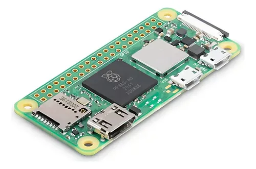
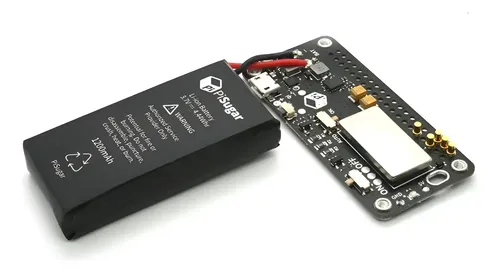

# Tamagotchai

AI status companion for Raspberry Pi e-paper displays. Polls service endpoints and renders a multi-screen dashboard -- status boards, tamagotchi agents, and more.

## What it does

- Polls public status endpoints (Atlassian Statuspage, raw JSON) on configurable intervals
- Renders monochrome screens on Waveshare 2.13" e-paper displays (V1-V4, plus color variants)
- Shows per-component status: OK / DEGRADED / DOWN / UNKNOWN
- Tamagotchi screens with sprites, mood mapping, and live agent stats
- Built-in ui/ template system with boot, setup, idle, error, and message screens
- Retains last known state on fetch failures (marked STALE)
- Runs as a systemd service with auto-restart
- Interactive setup wizard (`python app.py init`)

## Hardware

| | Component | Specs |
|---|---|---|
|  | [Raspberry Pi Zero 2 W](https://www.mercadolibre.com.ar/raspberry-pi-zero-2w-made-in-uk/p/MLA35340704) | 1GHz quad-core Cortex-A53, 512MB RAM, WiFi + BT |
|  | [Waveshare 2.13" e-Paper HAT+ V3](https://www.mercadolibre.com.ar/modulo-pantalla-epaper-213-hat-para-raspberry-pi--esp32/up/MLAU3363923079) | 122x250px, black/white, SPI, partial refresh |
|  | [PiSugar S 1200mAh](https://articulo.mercadolibre.com.ar/MLA-1550119923-pisugar-s-portable-1200-mah-ups-bateria-de-litio-pwnagothi-_JM) | Battery + UPS, onboard button (GPIO3), micro USB charge |

### Assembly

1. Stack **PiSugar S** onto the Pi Zero 2 W (bottom connector, align USB ports)
2. Seat the **e-Paper HAT** onto the 40-pin GPIO header
3. Insert microSD with Raspberry Pi OS, power via PiSugar's USB port

No soldering, no extra cables.

## Quick start: laptop (mock mode)

```bash
python3 -m venv venv
source venv/bin/activate
pip install -r requirements.txt
python app.py init        # Interactive setup wizard
python app.py preview
# See: ./out/frame.png
```

## Fresh Raspberry Pi setup

Tested on Raspberry Pi OS Trixie (64-bit, Debian 13).

### Step 1: System packages

```bash
sudo apt update
sudo apt install -y python3-lgpio python3-spidev python3-rpi.gpio python3-pip python3-setuptools python3-venv
```

`python3-lgpio` is required on Trixie/Bookworm. These releases replaced the deprecated `/sys/class/gpio` sysfs interface with the character device `/dev/gpiochip*`. Without `lgpio`, gpiozero falls back to `NativeFactory` which crashes on pin export.

### Step 2: Enable SPI

```bash
sudo raspi-config
# Interface Options -> SPI -> Enable -> Finish -> Reboot
```

Verify after reboot:
```bash
ls /dev/spidev0.0 /dev/spidev0.1
```

### Step 3: Install Waveshare e-paper driver

The Waveshare driver is not on PyPI. Install it from their GitHub repo:

```bash
cd ~
git clone https://github.com/waveshareteam/e-Paper.git
cd e-Paper/RaspberryPi_JetsonNano/python
sudo python3 setup.py install
```

Verify:
```bash
python3 -c "from waveshare_epd import epd2in13_V3; print('OK')"
```

### Step 4: Add user to GPIO/SPI groups

```bash
sudo usermod -a -G spi,gpio $USER
```

Log out and back in for group changes to take effect.

### Step 5: Deploy the application

On the Pi:
```bash
cd ~
git clone https://github.com/mattaereal/compainon.git tamagotchai
cd tamagotchai
./scripts/install.sh
```

### Step 6: Configure for e-paper display

Run the setup wizard:
```bash
python app.py init
```

Or manually edit `config/display.yml`:
```yaml
backend: waveshare_2in13_v3  # was: mock
```

Width and height are auto-set from the backend profile. No need to set them manually.

### Step 7: Set GPIO pin factory

Required on Trixie/Bookworm so gpiozero uses `lgpio`:

```bash
export GPIOZERO_PIN_FACTORY=lgpio
echo 'export GPIOZERO_PIN_FACTORY=lgpio' >> ~/.bashrc
```

### Step 8: Test

```bash
source venv/bin/activate
export GPIOZERO_PIN_FACTORY=lgpio
python app.py once
```

You should see the e-paper display update with the status dashboard.

### Step 9: Install as systemd services

The install script auto-detects your repo path and username, so the services work regardless of where you cloned:

```bash
sudo ./scripts/install_services.sh
```

This deploys both `tamagotchai` (main app) and `pisugar-button` (button daemon). Re-run after `git pull` to update paths.

View logs:
```bash
sudo journalctl -u tamagotchai -f
sudo journalctl -u pisugar-button -f
```

Stop/restart:
```bash
sudo systemctl restart tamagotchai
sudo systemctl restart pisugar-button
```

## Wi-Fi Onboarding

The `wifi/` subsystem provides a captive-portal Wi-Fi setup -- no keyboard or screen needed to configure Wi-Fi.

**How it works:**
1. On boot, waits up to 45s for an existing Wi-Fi connection
2. If no Wi-Fi, creates an open hotspot (`TAMAGOTCHAI-SETUP`)
3. User connects phone to the hotspot, opens `http://10.42.0.1`
4. Selects a network, enters password, taps Connect
5. Pi connects and the hotspot shuts down automatically

**Force setup mode:** Place an empty file at `/boot/firmware/setup-wifi` on the SD card, then reboot.

**Install the wifi services** (included in `install_services.sh`):
```bash
sudo ./scripts/install_services.sh
```

**Manual commands:**
```bash
sudo ./wifi/scripts/start_setup_mode.sh    # Start setup mode now
sudo ./wifi/scripts/stop_setup_mode.sh     # Stop setup mode
sudo ./wifi/scripts/add_wifi.sh SSID PASS  # Add a network from CLI
sudo ./wifi/scripts/doctor_wifi_setup.sh   # Check wifi setup health
```

**Display integration:** When setup mode activates, the e-paper shows the hotspot SSID and URL automatically.

See `wifi/docs/wifi-setup.md` for full documentation.

## CLI reference

```bash
python app.py init                          # Interactive setup wizard
python app.py doctor                        # Check environment and dependencies
python app.py preview                       # Render to PNG (mock mode, no hardware)
python app.py demo                          # Render with mock data (no network)
python app.py demo --animate                # Animate status changes
python app.py ui-preview                    # Preview all ui/ templates
python app.py once                          # Fetch + render once, then exit
python app.py run                           # Long-running poll loop
python app.py run --once-after 30           # Wait 30s before first refresh
```

## Configuration

Configuration is split across three files in `config/`:

| File | Purpose |
|---|---|
| `display.yml` | Display hardware (backend, resolution, refresh settings) |
| `tamagotchai.yml` | App-level settings (refresh interval, timezone) |
| `screens.yml` | Screen definitions (status boards, tamagotchis) |

### display.yml

```yaml
backend: waveshare_2in13_v3     # See supported backends below
rotation: 0
full_refresh_every_n_updates: 50
```

Supported backends:

| Backend | Display | Resolution | Partial refresh |
|---|---|---|---|
| `mock` | PNG file output | 122x250 | N/A |
| `waveshare_2in13_v1` | V1 (B/W) | 122x250 | Yes (LUT swap) |
| `waveshare_2in13_v2` | V2 (B/W) | 122x250 | Yes |
| `waveshare_2in13_v3` | V3 (B/W) | 122x250 | Yes |
| `waveshare_2in13_v4` | V4 (B/W, fast refresh) | 122x250 | Yes |
| `waveshare_2in13bc` | BC (B/W/R, 104x212) | 104x212 | No |
| `waveshare_2in13b_v3` | B V3 (B/W/R) | 122x250 | No |
| `waveshare_2in13b_v4` | B V4 (B/W/R) | 122x250 | No |
| `waveshare_2in13d` | D (B/W, flexible, 104x212) | 104x212 | Yes |
| `waveshare_2in13g` | G (4-color) | 122x250 | No |

Width/height are auto-set from the backend profile and usually don't need to be specified.

### tamagotchai.yml

```yaml
refresh_seconds: 30
timezone: UTC
```

### screens.yml

See `config/screens.yml.example` for the full annotated config with both templates.

## Troubleshooting

### `ModuleNotFoundError: No module named 'lgpio'`

```bash
sudo apt install python3-lgpio
```

### `PinFactoryFallback: Falling back from lgpio`

Set the environment variable:
```bash
export GPIOZERO_PIN_FACTORY=lgpio
```

### `OSError: [Errno 22] Invalid argument` on `/sys/class/gpio`

You are on Trixie/Bookworm which removed the sysfs GPIO interface. Set:
```bash
export GPIOZERO_PIN_FACTORY=lgpio
```

### Display not updating

Check in order:
```bash
# 1. SPI enabled?
ls /dev/spidev0.0

# 2. Waveshare driver installed?
python3 -c "from waveshare_epd import epd2in13_V3; print('OK')"

# 3. GPIO pin factory set?
echo $GPIOZERO_PIN_FACTORY   # should print: lgpio

# 4. Config backend correct?
python3 -c "import yaml; print(yaml.safe_load(open('config/display.yml')).get('backend'))"

# 5. User in correct groups?
groups   # should include spi and gpio

# 6. Test with mock first:
#    Set backend: mock in config/display.yml, then: python app.py preview
```

### venv can't find lgpio / spidev / waveshare_epd

The venv was created without `--system-site-packages`. Fix:
```bash
rm -rf venv
python3 -m venv --system-site-packages venv
source venv/bin/activate
pip install -r requirements.txt
```

## Development

```bash
python3 -m venv venv
source venv/bin/activate
pip install -r requirements.txt
python app.py init           # Generate config
python -m pytest tests/ -v   # Run tests
```

## License

MIT License
